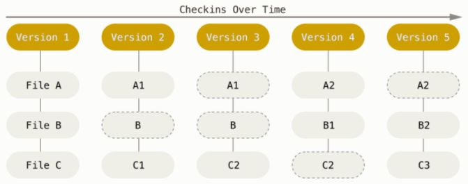

[this repo](https://github.com/kovacsnandor/GitParancsok)

# Git telepítése a számítógépre
[telepítés cikk](https://phoenixnap.com/kb/how-to-install-git-windows)
[git oldal](https://git-scm.com/)

## Lépéssek
1. Parancsori lehetőségek: GitBash ajánlott  
    

2. Alapértelmezett editor: Note++, VsCode, stb.  
   

3. A fő ág elnevezése:
    - Régen ez master volt, ma main
    - Ez csak a régi repositorikra vonatkozik  
    

4. Melyik command ablakba integrálja magát.  


5. Milyen biztonságos csatornán kommunikáljon a távoli repo-val.  


6. Hol legyen a certificate (tanúsítvány) fájl.  


7. Mi legyen a sorvége jel (Wondowsnál az első ajánlott).  


8. Melyik terminált emulálja a GitBash.  


9. Dafault ajánlott: pull esetén ha nálunk nics változtatás, akkor lehúzza, egéybként megpróbálja merge-elni.  


10. Ne kelljen állandóan beírni az azonosító lulcsot, csak egyszer.  


11. Extra opciók.  


12. Kisérleti opciók.  


## Git verziója
`git --version`

# Git működése
## Verziók tárolása
A Git a különböző verzióknál 
- nem a különbségeket, hanem a megváltozatott teljes állományokat tárolja, 
- kivéve, ha valami nem változott.


## Hol zajlanak a műveletek
- A git műveletei gyakorlatilag a helyi repóban zajlanak
- A távoli repó szinkronizálásra és fejlesztői kommunikációra való

## Verziók megkülönböztetése
- Minden változtatásról készített pillanatfelvétel (commit) egy 
- hash kód jellemez, ami:
    - 40 karakterből álló karaktersorozat (helxadecimális számjegyek)
    - egyedi
    - lavina hatás: kis változás a kódban, nagy változás a hash-ben

## A három állapot
A Gitnek három fő állapota van, amelyekben a fájlok elhelyezkedhetnek: 
- módosított:
    - módosítottuk a fájlt, de még nem helyeztük el az adatbázisába
- színpadi (stage):
    - a véglegesítéshez megjelölt (színpadra (stage) helyezett) fájlok
- véglegesített (commit):
    - A helyi repóban tárolt állománylok

Állapotábra: 
  

## Parancs logika
- Minden parancs a `git` kulcsszóval kezdődik
- Help: `git`
- Parancs szerkezet. `git <parancs> [<argumentumok>]`
- Argumentumok (módosítók):
    - hosszú paraméter példa: `git config --list`
    - rövid paraméter példa:  `git config -l`

## Config
### A config fájlok helye és neve
[cikk](https://www.theserverside.com/blog/Coffee-Talk-Java-News-Stories-and-Opinions/Where-system-global-and-local-Windows-Git-config-files-are-saved)
A config vájlok a `config` nevű állományban találhatók.
- Globális config fájlok: A profilunkban valahol.
- Lokális: A `.git/config` állományban
    - Ütközés esetén a **lokális az erősebb**.

### Config fájlok listázása
`git config --list`: Az **aktuális** (local, global) **beállítások** listázása (kilpép: q).
`git config --list --show-scope`: A beállítások local, global szelektált listázása.
`git config user.email`: Egy adott beállítás (pl. Email) értékének listázása.

### Config fájlok szerkesztése
A globálisan beállított editorban megnyílik a konfigurációs fájl.  
`git config --edit`: Lokális beállítások.
`git config --edit --global`: Golbális beállítások.


## Fontos beállítások

### Email és User név beállítása
A commit-nál elengedhetetlen, hogy lássuk, ki tette, ezért be kell állítani egy emailt, és user nevet. Ez lehetőleg a GitHUb regisztrációnk szerinti legyen.  

**Globálisan**:  
`git config --global user.email "xy.gmail.com"` : **Email** megadása **globálisan**  
`git config --global user.name "xy"` : **Usernév** megadása **globálisan**  

**Lokálisan**:  
`git config user.email "xy.gmail.com"` : **Email** megadása **lokálisan** (csak arra a mappára)  
`git config user.name "xy"` : **Usernév** megadása **lokálisan**  

`git config --list` : A konfig fájl listája (kilépés: `q`)

### Email és User név beállítása kötegelt fájlból
[cikk](https://stackoverflow.com/questions/5401229/how-do-i-execute-several-git-commands-in-a-batch-file-without-terminating-after)
1. Hozz létre egy emus.bat szövegfájlt (mindegy a fájl neve)
2. írd be ezt a két sort:
```.bat
git config user.email "xy.gmail.com"
git config user.name "xy"
```
3. a parancs ablakba írd be: `emus.bat` és enter (A két parancs egymás után lefut)
4. Ha nem akarod hogy ez a fájl szinkronizálódjon, tedd be a `.gitignore` fájlba.
```.gitignore
emus.bat
```
5. Ezt a fájlt használhatod más projektekhez


# Git Parancsok

## Helyi repo

### Helyi repo létrehozása
`git init`: Helyi repo létrehozás (mappán belül).  
`git init mappa` : Helyi repo létrehozása a mappa nevű mappában.  

### Alap parancsok
**Status**:  
`git status`: Git állapotának lekérdezése.  


**Stage (színpad)-ra rakás**  
`git add .`: Minden fájl -> színpad (stage).   
`git add *.txt`: Minden txt fájl -> színpad (stage).  
`git add valami.txt`: valami.txt fájl -> színpad (stage).  

**Vissza a színpadról**:  
`git restore --staged fájlnév`: Egy vagy több fájl visszahívása a színpadról.  

**Az új bejegyzések törlése színpad előtt**:  
`git restore fájlnév`: A fájlon trötént változatások visszavonása


**Commit**:
Commit (A commit üzenete: `miért csináltuk`, ne az hogy mit csináltunk).

`git commit -m "Commit üzenet"`: A helyi repóba mentjük a színpad tartalmát (commit).  
`git commit -am "Commit üzenet"`: Add és commit összevonása (mindent színpadra tesz). 

`git diff` : Megnézhetem commit előtt (míg a színpadon van), hogy mit változtattam az előzőhöz képest .

### Listázások: log, show
log: commit listák  
`git log`: Commitok részletes listázása  
`git log --oneline`: Commitok tömör listázása  
`git log --oneline --graph`: Commitok tömör listázása  "grafkusan"  
`git log --pretry=oneline`: Commitok tömör listázása (egymás alá) 
`git log --pretry=oneline --graph`: Commitok tömör listázása (egymás alá) 

show: adott commit adatainak listázása
`git show`: Az aktuális commit minden adatának listázása (még a diff is)
`git show v1.0`: A v1.0-ás tag-ű commit listázása

### Időgép parancsok
A `HEAD` mutató mutatja, hogy melyik commiton állunk.  
Nomrál esetben a HEAD a branch-re mutat: `attach állapot`.  
Ha elmozgatjuk a HEAD-et, akkor `detach állapotban` vagyunk  
`git checkout commitID`: Időgép: a megadott commitID-jű állapotba állítja a projektet  
`git checkout HEAD~1`: Időgép: menj egy committal előbbi állapotra  
`git checkout -`: Időgép: Állj vissza oda, ahonnan eredetileg jöttél  
`git checkout v1.0`: Időgép: menj a v1.0-ás tag-ű commit állapotra  
`git checkout master`: Időgép: visszaállás a legfrisebb állapotra  

### Branch (ágak)
- Alapban a `master` nevű ág van, abban vagyunk.
- A külön ágak azért kellenek, hogy egymástól elkülönülve tudjunk fejleszteni pl. a következő verziót
- A végén az ágat egyesítjük a master ágba, és ez lesz az aktuális verzió
    - Így ha baj van, vissza tudunk térni az ez előtti verzióra
- Ág egyesítés (`honnan ág`-ból a `hova ág`-ba):
    - Átmegyek abba az ágba ahova egyesíteni akarok (pl. master): `git checkout master`
    - Kiadom a merge parancsot (`merge művelet`): melyik ágat egyesítsem ide: `git merge 1.0`
    - Úgy mondjuk: "bemergeltem az 1.0-ás ágat a master brech-be"
    - A `merge` összegyűjti az az összes olyan commitot a honnan ágból ami nincs a hova ágban, és átpakolja.
    - A `merge` után a honnan ág nem szűnik meg, csak bele egyesül a hova ágba
- Konfliktus: Akkor történik, ha:
    - a honnan és hova ágban uganabban a fájban módosítottuk ugyanazt a sort, és mergelünk.
    - A rendszer jelzi, hogy konfliktus van
    - Feloldás: 
        - A probémás fájlba a rendszer mindkét változatot beteszi, és kézzel eldöntjük, hogy melyik jó.

Létrehozás:  
`git checkout -b 1.0`: Új branch (ág) létrehozása (pl. `1.0`), átváltás az új ágra  
`git branch 2.0`: Új branch (`2.0`) létrehozása, de nem vált át
`git switch -c 3.0`: Új branch (ág) létrehozása (pl. `3.0`), átváltás az új ágra  
`git branch 4.0 34d56fgz`: Új branch (`4.0`) a `34d56fgz` committól elágazva

Átnevezés:  
`git branch -m valami mas`: A `valami` branch átnevezéses `mas`-ra

Törlés:
- Amin állunk, azt nem lehet törölni
- Ami még nem lett merge-ölve, azt csak `D`-vel lehet törölni 
`git branch -d 3.0`: Lágy törlés: a `3.0` branch törlése (törlődik ha üres, vagy már merge-ölve volt)  
`git branch -D 3.0`: Hard törlés: akármi van, törlődik, de fizikailag nem törlődik csak nem lehet látni. A hash-vel még vissza lehet rá menni. De egy idő után automatikusan el fog tűnni.

Lekérdezés, ugrás:   
`git branch`: Branc-ek (lokális) lekérdezése (azt is mutatja, hogy jelenleg hol vagyok)  
`git branch -l m*`: Az m-el kezdődő ágak lekérdezése
`git branch -v`: Az ágak lekérdezése és azok commit hash-ei
`git branch -vv`: Az ágak lekérdezése és azok commit hash-ei, és kimutja, hogy melyik branch követi a távoli branch-et.
`git branch --remote`: A távoli (GitHUb) branch-ek listája

Átváltás:  
`git checkout master`: Ugrás a megadott (pl. master) ágra  
`git switch master`: Ugrás a megadott (pl. master) ágra
`git switch -`: Ugrás az előző ágra

Merge:  
`git merge 1.0`: Az 1.0-ás ág egyesítése azzal az ággal, ahol vagyok.
Merge típusok:  
- `Fast-forward` (előre ugrás): olyan merge, hogy közben a master nem változott (nem divergáltak az ágak)

- `Three-way` merge (három utas): olyan merge, hogy közben a master változott (divergáltak az ágak)


`git merge --abort`: Konfliktusos helyzetben (marging állapotban) visszavonhatjuk a merge szándékunkat.

## Helyi repo - GitHUb összekapcsolódás
Az első push-nál `personal acces token`-t kell létrehozni:
- Github / Setting / Developer settigs
    - Personal access tokens
        - Generate new token
            - Kell egy név
            - mennyi időre
            - pipáljuk a repo-t
            - Ad egy tokent
            - ezt kell beilleszteni

### VsCode és GitHub összekapcsolása
[cikk](https://josuamarcelc.com/github-personal-access-token-on-vscode/)      
[videó](https://www.youtube.com/watch?v=IJf_Tryhzic)   

- klónozás tokennel:
    - `git clone https://<TOKEN>@github.com/<username>/<repository_name>.git`
- kapcsolódás egy meglévő repo-hoz:
    - `git remote set-url origin https://<TOKEN>@github.com/<username>/<repository_name>.git`    

### Meglévő GitHub repo klónozása
`git clone url`: A helyi gép mappájába lehúzza az url-hez tartozó gitHub repót a repó nevének mappájába  
`git clone url mappa`: A helyi gép mappájába lehúzza az url-hez tartozó gitHub repót a megadott nevű mappába  

### First GitHud módszer
Ez a legcélravezetőbb:
1. A GitHub-on létre kell hozni egy repót README.md-vel
2. Ki kell másolni a repóhoz tartozó url-t
3. Helyi gépen egy mefelelő mappába kónozni:
`git clone url`

### First Helyi repó módszer
#### A projekt mappájának parancssorában (ez lesz a projekt neve):
1. Heyi repó létrehozása: `git init`
2. Létrehozni a **README.md** fájlt.
3. README.md -> színpad (stage): `git add README.md`
4. Commit: `git commit -m "first commit"`  
#### A GitHub-on:
5. Létrehozni a projektet **README.md nélkül !!!** és kimásolni az url-t
#### Helyi gép parancssorában:  
6. kapcsolódni a GitHub projekthez origin néven: `git remote add origin url`  
  (Ha az 5. lépésben mégis létrehoztuk a README.md fájlt, akkor ki kell adni az alábbi parancsot:  
  `git pull origin master --allow-unrelated-histories`)
7. Ha rossz helyre kapcsolódtunk, vissza lehet vonni: `git remote remove origin`
8. Feltölteni ami a helyi repo-ban van: `git push -u origin master`

### A távoli repó (GitHub) lekérdezése
`git remote`: a távoli repo álneve: origin
`git remote -v`: a távoli repo url-je
`git remote show origin`: távoli repo állapotának lekérdezése

### push, pull
`git push`: A commitált változtatások felküldése a távoli repóba (csak az aktuális ág fog felkerülni)  
`git push --all`: Minden ág felkerül (ezt nem érdemes csinálni, mert a saját ágaink lehet hogy nem érdekesek.)  
`git pull`: A távoli repóból lehúzza a változatásokat (érdemes mindig ezzel kezdeni)  
Ha a távoli repóban van változás és még nem volt pul, akkor nem működik a push  

`git fetch`: lehozza változatásokat, de nem mergeli össze a helyi repóval. Ezután ki kell adni:  
`git merge origin/master`


### Tag-ek
Egyes kommitok megjelölésére szolgál. pl. ez már egy kiforrott verzió, mérföldkő, valamilyen állapot stb. A tag könyvjelzőnek is felfogható.  
- A tag ahhoz a commithoz kötődik, ami után azt létrehozzuk.  
- Egy commithoz `bármennyi tag` hozzárandelhető  
- Utólag a tag `nem módosítható`
- A tag-ek `törölhetők`
- Két fajta tag létezik:
    - `Annotált tag`: plusz meta adatokat lehet hozzáadni a tag-hez.
    - `Light (egyszerű) tag`: csak egy címke

`git tag -a címke -m "valami üzenet"`: Annotált tag létrehozása
`git tag címke`: Light tag létrehozása
`git tag címke 721a34b`: Egy megydott hash kódú commit utólagos tag-elése
`git tag -d v1.1 zoli`: Az v1.1 és a zoli tag-ek törlődnek az commitokból
`git tag`: Tag-ek listázása (minden tag)
`git tag --list "v*"`: A v-vel kezdődő tag-ek listázása
`git push --tags`: Tag-ek pusholása (???) 

## Kollaboráció
Settings / Manage access

## Ágak (branch)
Egy ágat azért hozunk létre, hogy anélkül fejlesszünk, hogy zavarnánk a többi ágat.  
Ha kész vagyunk a fejlesztéssel, akkor a master ágba egyesíthetjük: merge.  
A helyi repó ágai nem kerülnek fel a GitHub-ra ott külön létre kell őket hozni.  


# Minta fejlesztés
## Fogalmak
`deployment`: az első publikált állapot a gitHUb-on. 

A branc-ek azért vannak, hogy el tudjuk különíteni a fejlesztéseket.  


